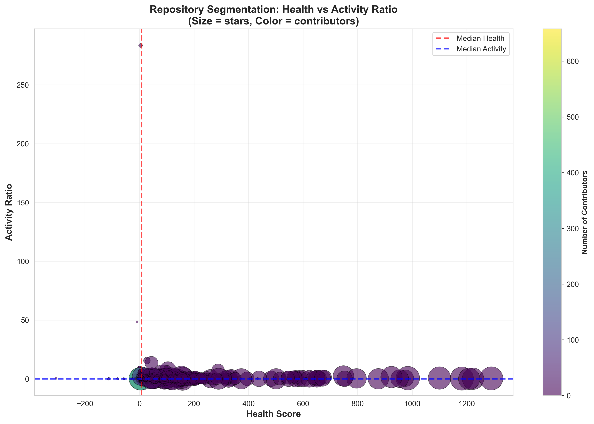

# 
Image by <a href="https://unsplash.com/es/@priscilladupreez?utm_source=unsplash&utm_medium=referral&utm_content=creditCopyText">Priscilla Du Preez 🇨🇦</a> at <a href="https://unsplash.com/es/fotos/three-men-laughing-while-looking-in-the-laptop-inside-room-XkKCui44iM0?utm_source=unsplash&utm_medium=referral&utm_content=creditCopyText">Unsplash</a>
      

# InnerSource Community Health Analysis 🐙📊

An exploratory data analysis of public GitHub repositories to uncover the key drivers behind healthy, collaborative InnerSource software communities.

## About The Project

### Project Goal
To analyze a dataset of over 1,000 public GitHub repositories and identify the metrics and patterns that define the health, collaboration dynamics, and long-term sustainability of effective InnerSource communities in technical organizations.

### Storyline: "What Drives Collaboration? Patterns Behind Healthy InnerSource Communities"
This narrative explores how activity metrics (stars, forks, issues, pull requests, contributors) and responsiveness indicators distinguish thriving technical communities from stagnant or struggling ones – and identifies actionable practices to foster sustainable InnerSource adoption.

### Key Research Questions
1. What are the key metrics and activity patterns that distinguish healthy InnerSource software communities from stagnant or struggling ones?
2. Is there a relationship between the number of active contributors and responsiveness (issue or pull request resolution speed) in these communities?
3. What actionable patterns can be visualized to help organizations foster more effective and sustainable InnerSource collaboration?

### Insights Preview


### Full Report
For comprehensive analysis and findings, see the final deck: [What Makes InnerSource Communities Healthy?](InnerSourceCommunitiesHealthy.pdf)

## Getting Started
Check [technical_documentation.md](technical_documentation.md) for detailed documentation on:
- Installation requirements
- Project structure
- Dataset description
- Analysis process

## Repository Structure Overview
This repository includes:
- Jupyter notebooks for EDA and analysis
- Visualizations of key findings
- Processed statistics and features
- Utility functions for analytics

Refer to the [technical documentation](technical_documentation.md) for technical setup and usage.

## Authors and Acknowledgment

This analysis was performed by:

- [Ana Gamito](https://www.linkedin.com/in/ana-gamito/)

During the [Allwomen Data Analytics Bootcamp](https://www.allwomen.tech/bootcamp/data-analytics-bootcamp/)

## License

MIT License - see the [LICENSE](LICENSE) file for details.

## Data Source

Analysis uses data extracted from public [GitHub](https://github.com) repositories, including metrics for contributions, issues, pull requests, and more. Dataset sourced from: [Kaggle GitHub Dataset Link](https://www.kaggle.com/datasets/nikhil25803/github-dataset)

## Citation

If using this analysis or GitHub repository data, please cite:

```
Gamito, Ana. (2025). InnerSource Community Health Analysis. Allwomen Data Analytics Bootcamp.
```
