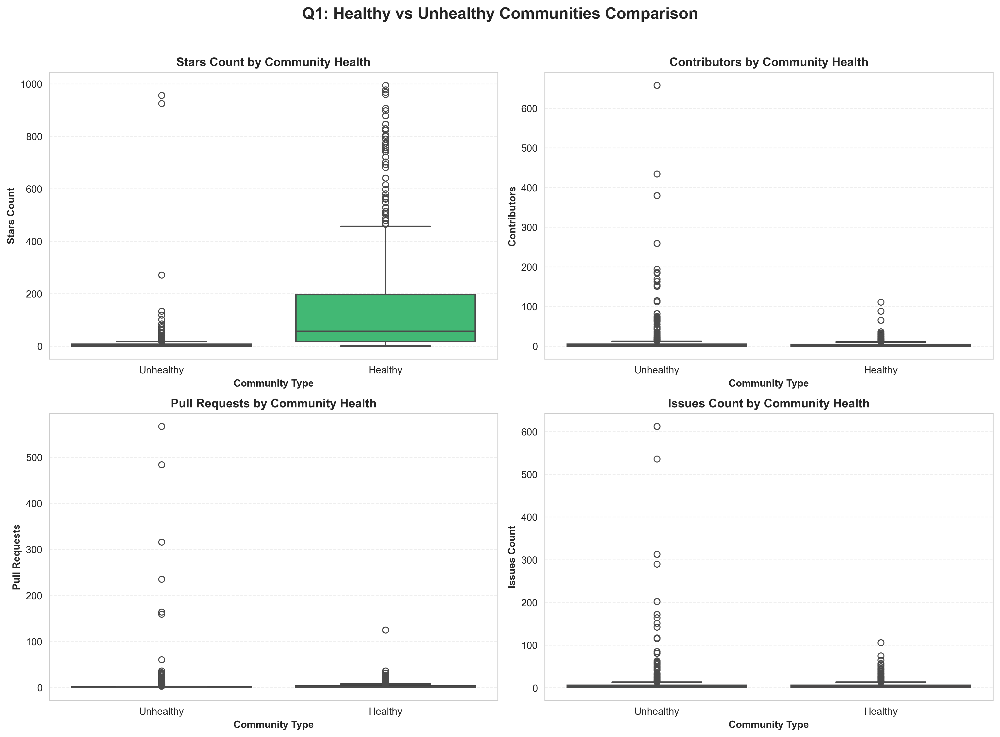
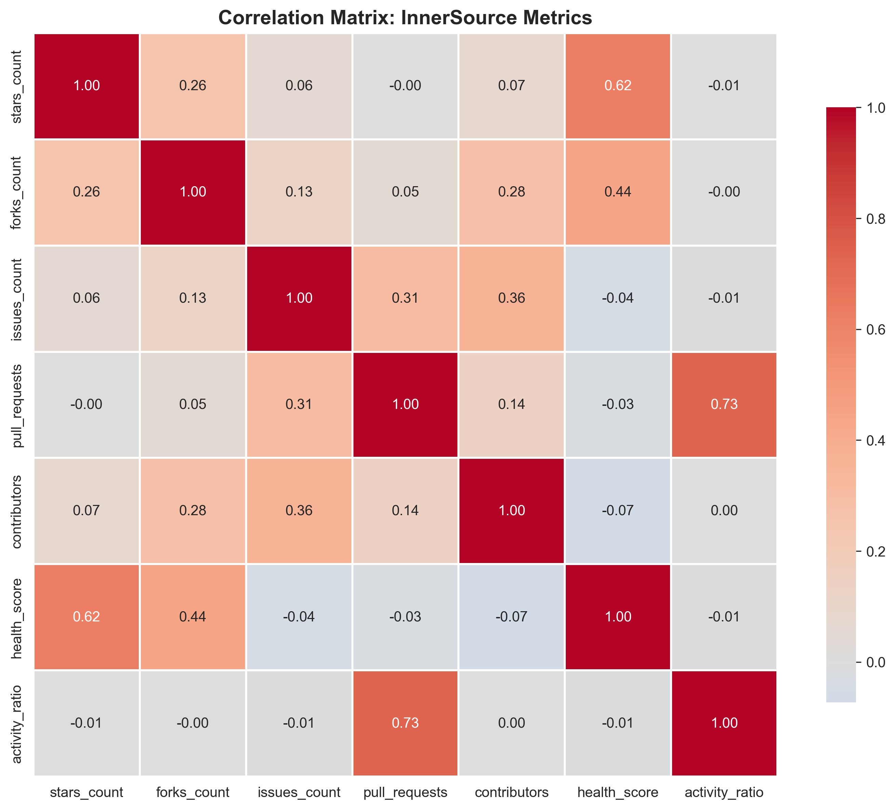

# InnerSource Community Health Analysis


<sub>Image by <a href="https://unsplash.com/es/@priscilladupreez">Priscilla Du Preez 🇨🇦</a> at <a href="https://unsplash.com/es/fotos/three-men-laughing-while-looking-in-the-laptop-inside-room-XkKCui44iM0">Unsplash</a></sub>

---

An exploratory data analysis of 1,052 public GitHub repositories to uncover the key drivers behind healthy, collaborative InnerSource software communities.

---

## About The Project

### Project Goal
To analyze GitHub repositories and identify the metrics and patterns that define the health, collaboration dynamics, and long-term sustainability of effective InnerSource communities in technical organizations.

### Storyline: "What Drives Collaboration? Patterns Behind Healthy InnerSource Communities"
This narrative explores how activity metrics (stars, forks, issues, pull requests, contributors) and responsiveness indicators distinguish thriving technical communities from stagnant or struggling ones – and identifies actionable practices to foster sustainable InnerSource adoption.

### Key Research Questions
1. What are the key metrics and activity patterns that distinguish healthy InnerSource software communities from stagnant or struggling ones?
2. Is there a relationship between the number of active contributors and responsiveness (issue or pull request resolution speed) in these communities?
3. What actionable patterns can be visualized to help organizations foster more effective and sustainable InnerSource collaboration?

---

## Important Notice: Why Public Repositories?

This analysis uses **public open source repositories** as a proxy for InnerSource communities. While our goal is understanding **private InnerSource dynamics**, we chose public data for:

- **Data Privacy** — InnerSource projects contain proprietary code and sensitive organizational metrics that cannot be publicly shared
- **Transparency** — Public data enables full reproducibility and validation of results
- **Generalizability** — Open source and InnerSource share fundamental collaboration mechanics (issues, PRs, contributor patterns)

**For organizations:** The metrics framework (Health Score, Activity Ratio, four-quadrant segmentation) transfers directly to internal repositories. Calibrate thresholds to your organizational context while applying the same analytical approach.

---

## Key Findings

### Four Community Profiles Identified

| Profile | Health Score | Activity Ratio | Status |
|---------|--------------|----------------|--------|
| **Thriving** | High | High | Popular, responsive, well-maintained |
| **Stable** | High | Low | Mature projects with low maintenance needs |
| **Emerging** | Low | High | High potential but needs support |
| **At Risk** | Low | Low | Stagnant, accumulating backlog |

### Critical Insights

- **Health ≠ Popularity** — A 10,000-star project with 2 contributors is fragile; a 100-star project with 20 engaged contributors is sustainable

- **Responsiveness > Team Size** — A well-organized team of 5 outperforms a chaotic team of 20

- **Metrics Enable Early Intervention** — Monitoring `Health Score` and `Activity Ratio` provides early warning signals before communities collapse

- **Collaboration is a Practice** — Clear processes, communication, and contributor guidelines scale better than headcount

---

## Quick Start

```
# Clone the repository
git clone https://github.com/Tsuna-mi/innersource-eda-project.git
cd innersource-eda-project

# Install dependencies
pip install -r requirements.txt

# Open the analysis notebook
jupyter notebook notebooks/InnerSource_EDA_Analysis.ipynb
```

---

## Documentation

- **[Jupyter Notebook](notebooks/InnerSource_EDA_Analysis.ipynb)** — Full EDA workflow with code and visualizations
- **[Technical Documentation](technical_documentation.md)** — Dataset details, methodology, dependencies, and analysis process
- **[Final Presentation](InnerSourceCommunitiesHealthy.pdf)** — Key findings and recommendations

---

## Sample Visualizations

### Repository Segmentation by Health & Activity


### Healthy vs. Unhealthy Communities Comparison


### Correlation Matrix: InnerSource Metrics


---

## Author

- [Ana Gamito](https://www.linkedin.com/in/ana-gamito/)

*This project was developed during the [Allwomen Data Analytics Bootcamp](https://www.allwomen.tech/bootcamp/data-analytics-bootcamp/) (Nov 2025)*

---

## License

MIT License - see the [LICENSE](LICENSE) file for details.

---

## Citation

If using this analysis or methodology, please cite:

```
Gamito, Ana. (2025). InnerSource Community Health Analysis. Allwomen Data Analytics Bootcamp.
```

---

## Acknowledgments

- [InnerSource Commons](https://innersourcecommons.org/) — Best practices and community resources
- [CHAOSS Project](https://chaoss.community/) — Community health metrics framework
- [Allwomen Bootcamp](https://www.allwomen.tech/) — Educational support and mentorship

---

**Questions?** Open an issue or reach out via [LinkedIn](https://www.linkedin.com/in/ana-gamito/)
